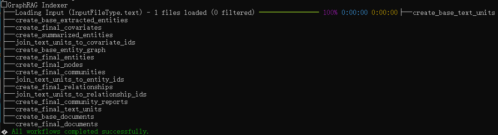

# GraphRAG

## References
👉 [https://github.com/microsoft/graphrag](https://github.com/microsoft/graphrag)

<div align="left">
  <a href="https://github.com/LayeVeitch/GraphRAG/issues">
    
  </a>
  <a href="https://github.com/LayeVeitch/GraphRAG/discussions">
    
  </a>
</div>

## 主要修改
适配ollama本地部署
英文知识图谱

## 快速开始
### 准备数据集
《A Christmas Carol》英文小说原文已存储在 `ragtest\input`

### 初始化项目文件夹
```shell
mkdir -p ./ragtest
python -m graphrag.index --init --root ./ragtest
```

### 准备文本数据
```shell
mkdir -p ./ragtest/input
cp data/book.txt ./ragtest/input/
```

### 构建索引
```shell
python -m graphrag.index --root ./ragtest
```
配置resume参数之后，失败了重新跑一遍就可以从断点继续，避免从头开始
```shell
python -m graphrag.index --root ./ragtest --resume ragtest -v
```
### 构建成功显示
